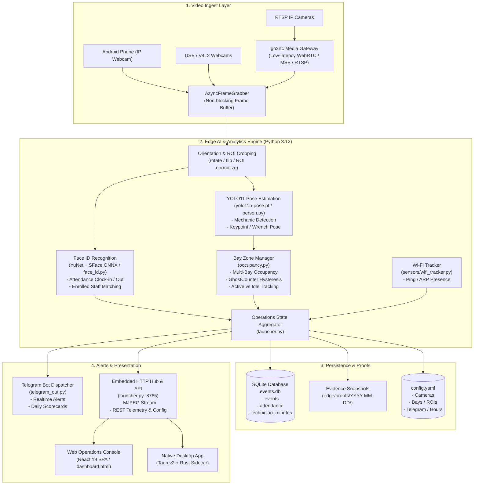
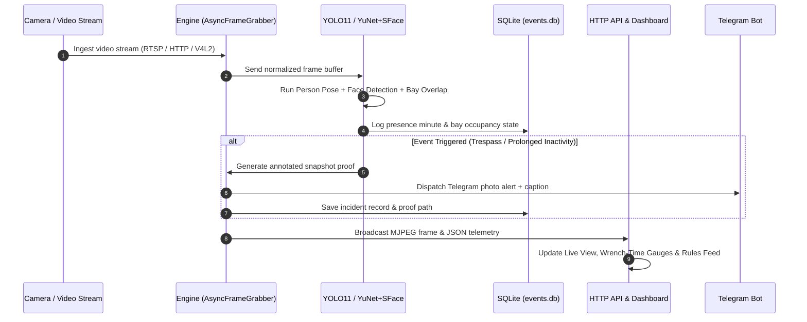

# Inbound Surveillance — Architecture & Project Structure

> **Inbound Surveillance** (also referred to as *Inbound Garage*) is an agentic computer vision and operations platform designed for commercial venues and auto shops. It transforms standard CCTV IP cameras, USB webcams, and mobile video feeds into proactive edge agents for real-time bay occupancy monitoring, technician wrench-time analysis, automated Face ID attendance, and instant Telegram alert dispatching.

---

## 1. System Architecture



---

## 2. Directory Tree

```
Inbound-Surveillance/
├── .github/
│   └── workflows/
│       └── build-desktop.yml      # CI workflow for building Tauri desktop app
├── docs/                          # Project documentation & Stitch UI designs
│   ├── stitch/
│   │   ├── clearview-camera-hub/  # Camera hub screen specifications & design assets
│   │   └── inbound-surveillance-dashboard/ # Operations dashboard design mockups
│   └── PROJECT_STRUCTURE.md       # Current project structure & architecture (this file)
├── edge/                          # Edge AI Vision & Processing Engine (Python)
│   ├── adapters/                  # Camera source protocol adapters
│   │   ├── __init__.py            # Adapter factory (create_adapter)
│   │   ├── base.py                # Base camera adapter abstraction & URL parsing
│   │   ├── gateway.py             # go2rtc gateway adapter
│   │   ├── phone_http.py          # Android IP Webcam / MJPEG adapter
│   │   ├── rtsp.py                # OpenCV / FFmpeg RTSP adapter with reconnect logic
│   │   └── webcam.py              # Local USB / V4L2 webcam adapter
│   ├── bin/
│   │   └── go2rtc                 # Bundled go2rtc media streaming binary
│   ├── faces/                     # Enrolled staff facial biometric references
│   │   ├── README.md
│   │   ├── Sothun/                # Enrolled identity photo samples
│   │   └── Tharo/                 # Enrolled identity photo samples
│   ├── media/                     # Streaming server integration
│   │   ├── __init__.py
│   │   ├── client.py              # go2rtc HTTP REST client
│   │   └── go2rtc.py              # Managed go2rtc process controller
│   ├── models/                    # ONNX / PyTorch computer vision weights
│   │   ├── face_detection_yunet_2023mar.onnx   # OpenCV YuNet face detector
│   │   └── face_recognition_sface_2021dec.onnx # OpenCV SFace face embedder
│   ├── proofs/                    # Timestamped snapshot evidence storage
│   ├── sensors/                   # Auxiliary venue sensors
│   │   ├── __init__.py
│   │   └── wifi_tracker.py        # Wi-Fi network device presence scanner
│   ├── build_sidecar.py           # PyInstaller build script for Tauri sidecar binary
│   ├── capture.py                 # AsyncFrameGrabber background frame worker
│   ├── config.example.yaml        # Template configuration for cameras, bays, and tokens
│   ├── config.yaml                # Active runtime configuration
│   ├── db.py                      # SQLite database operations & analytical aggregations
│   ├── events.db                  # SQLite database file (events, attendance, minutes)
│   ├── face_id.py                 # Facial enrollment, detection, and recognition logic
│   ├── hub.html                   # Built-in lightweight camera hub web interface
│   ├── inbound-engine.spec        # PyInstaller specification for sidecar binary
│   ├── launcher.py                # Main backend server (HTTP API, MJPEG stream, telemetry)
│   ├── main.py                    # Standalone CLI / OpenCV live preview runner
│   ├── occupancy.py               # Bay ROI management, ghost filtering, and occupancy math
│   ├── paths.py                   # Cross-platform runtime path resolution
│   ├── person.py                  # YOLO11 pose / person inference & keypoint parsing
│   ├── proof.py                   # Proof snapshot annotator and file writer
│   ├── report.py                  # End-of-day daily operations report generator
│   ├── requirements.txt           # Python dependencies (OpenCV, Ultralytics, PyYAML, Requests)
│   ├── roi_edit.py                # Interactive ROI drag-and-drop bounding box handles
│   ├── telegram_out.py            # Telegram Bot API client for alert dispatches
│   ├── test_capture.py            # Unit / integration tests for video capture
│   ├── test_face_id.py            # Unit tests for face recognition
│   ├── test_garage.py             # Unit tests for garage bay logic
│   ├── test_go2rtc.py             # Unit tests for go2rtc integration
│   ├── yolo11n-pose.pt            # YOLO11 Nano pose estimation model
│   └── yolov8n.pt                 # YOLOv8 Nano object detection model
├── scripts/
│   └── ensure-dev-sidecar.mjs     # Dev pre-check script to stub or verify sidecar binary
├── src/                           # Frontend Web Application (React 19 + TypeScript)
│   ├── components/
│   │   └── ui/
│   │       └── blackhole-hero-section.tsx # Visual landing page particle hero
│   ├── dashboard/                 # Operations Console Single Page Application
│   │   ├── components/
│   │   │   ├── AlertsView.tsx     # Active security & anomaly alert feed
│   │   │   ├── CasesView.tsx      # Historic incident investigation log & snapshots
│   │   │   ├── LiveView.tsx       # Live camera grid, PTZ, bay overlays, and controls
│   │   │   ├── RulesView.tsx      # Detection rules & trigger parameter configuration
│   │   │   └── TelegramPanel.tsx  # Telegram notification testing & recipient management
│   │   ├── App.tsx                # Dashboard shell, pipeline status bar, and tab navigation
│   │   ├── dashboard.css          # Scoped dashboard stylesheet
│   │   ├── format.ts              # Timestamps, durations, and metric formatting helpers
│   │   ├── ids.ts                 # Unique ID generation utilities
│   │   ├── main.tsx               # Dashboard entry point
│   │   ├── rules.ts               # Default alert and anomaly rule definitions
│   │   ├── seed.ts                # Mock seed data for development and previews
│   │   ├── store.tsx              # React Context store managing live state & WebSocket/REST sync
│   │   └── types.ts               # Core TypeScript interfaces & data contracts
│   ├── desktop.tsx                # Tauri desktop loader & connection orchestrator
│   ├── engine-url.ts              # Dynamic resolution for backend engine URL & port
│   ├── hero-particles.tsx         # Hero canvas particle physics component
│   ├── index.css                  # Global Tailwind CSS styles
│   ├── main.tsx                   # Landing page React root entry
│   ├── page-particles.ts          # Interactive background particle effects
│   └── vite-env.d.ts              # Vite environment typings
├── src-tauri/                     # Tauri v2 Desktop App (Rust)
│   ├── binaries/
│   │   └── inbound-engine-x86_64-unknown-linux-gnu # Compiled PyInstaller sidecar
│   ├── capabilities/
│   │   └── default.json           # Tauri v2 window and shell permission capabilities
│   ├── icons/                     # Multi-platform app icons (macOS, Windows, Linux, iOS, Android)
│   ├── src/
│   │   ├── lib.rs                 # Tauri sidecar lifecycle manager & webview redirector
│   │   └── main.rs                # Tauri entry point
│   ├── Cargo.toml                 # Rust dependencies (tauri, tauri-plugin-shell, tauri-plugin-log)
│   └── tauri.conf.json            # Tauri v2 configuration (windows, bundle, security)
├── components.json                # shadcn UI / Tailwind component configuration
├── dashboard.html                 # HTML entry point for the Operations Console SPA
├── desktop.html                   # HTML entry point for the Tauri native desktop loader
├── favicon.svg                    # Application vector icon
├── fix-dashboard-unresponsive-prompt.md # Development notes & bugfix prompts
├── index.html                     # HTML entry point for the public landing page
├── landing-page-prompt.md         # Landing page design specification
├── package.json                   # NPM project scripts & dependencies
├── package-lock.json              # Locked NPM dependency graph
├── script.js                      # Vanilla JavaScript interactions for the landing page
├── styles.css                     # Primary landing page stylesheet
├── tsconfig.json                  # TypeScript compiler options
└── vite.config.ts                 # Vite build & development server configuration
```

---

## 3. Detailed Component Breakdown

### 3.1 Frontend & User Interface (`src/`, `*.html`)
- **Public Landing Page (`index.html`, `src/main.tsx`, `styles.css`)**:
  - High-performance marketing portal with 3D/canvas particles (`src/page-particles.ts`, `src/components/ui/blackhole-hero-section.tsx`).
  - Features product demos, architecture overview, pricing tiers, and contact forms.
- **Operations Console (`dashboard.html`, `src/dashboard/`)**:
  - Full-featured React 19 SPA for security operators and auto-shop managers.
  - **`LiveView.tsx`**: Multi-camera grid, live video streaming, interactive bay bounding boxes, real-time FPS/latency telemetry, and manual snapshot triggers.
  - **`RulesView.tsx`**: Visual rule editor for after-hours trespass, bay dwell time thresholds, wrench-time inactivity alarms, and cooldown timers.
  - **`CasesView.tsx`**: Audit trail of logged incidents with searchable filters, annotated proof images, and resolution statuses.
  - **`AlertsView.tsx`**: Triage queue for unacknowledged real-time events with direct Telegram dispatch triggers.
  - **`TelegramPanel.tsx`**: Telegram bot diagnostics, instant test messages, and notification preference controls.
  - **`store.tsx`**: Unified state management providing reactive feeds for detections, cameras, alerts, and system telemetry.
- **Desktop Loader (`desktop.html`, `src/desktop.tsx`)**:
  - Minimalist splash view rendered when launching the native Tauri desktop app.
  - Listens for the backend engine's `[INBOUND_SERVER_READY]` signal on stdout and seamlessly redirects the webview to the local server.

### 3.2 Native Desktop Layer (`src-tauri/`)
- **Tauri v2 + Rust Architecture**:
  - Provides a cross-platform desktop wrapper for macOS, Windows, and Linux.
  - **Sidecar Management (`src-tauri/src/lib.rs`)**: Spawns the compiled Python engine (`inbound-engine`) as a managed child process using `@tauri-apps/plugin-shell`.
  - Dynamically captures the allocated HTTP port from the engine's stdout output and redirects the webview.
  - Guarantees clean process teardown when the window closes or the application exits, preventing orphaned Python/FFmpeg processes.

### 3.3 Edge Engine & Computer Vision Pipeline (`edge/`)
- **Video Ingestion & Adapters (`edge/adapters/`, `edge/media/`, `edge/capture.py`)**:
  - Pluggable camera adapters (`rtsp.py`, `phone_http.py`, `webcam.py`, `gateway.py`).
  - Integrated with **go2rtc** (`edge/bin/go2rtc`, `edge/media/go2rtc.py`) for low-latency RTSP restreaming, WebRTC negotiation, and multi-client multiplexing.
  - `AsyncFrameGrabber` runs a dedicated background capture loop with configurable queue depths to prevent pipeline backpressure.
- **Computer Vision & Neural Models**:
  - **Pose Estimation & Mechanic Activity (`edge/person.py`)**: Uses YOLO11 Nano Pose (`yolo11n-pose.pt`) to detect technicians, track limb joints, and calculate wrench/work activity vs. idle standing.
  - **Face ID Attendance (`edge/face_id.py`)**: Uses OpenCV YuNet (`face_detection_yunet_2023mar.onnx`) for face bounding boxes and SFace (`face_recognition_sface_2021dec.onnx`) for cosine distance feature embeddings against enrolled staff photos in `edge/faces/`.
- **Occupancy & Operational Intelligence**:
  - **Bay Zone Manager (`edge/occupancy.py`)**: Computes normalized polygon/box overlaps with vehicle service bays. Incorporates `GhostCounter` hysteresis to prevent flickering between active/empty states during momentary occlusions.
  - **Wi-Fi Presence Correlation (`edge/sensors/wifi_tracker.py`)**: Scans local network devices via ICMP/ARP to corroborate whether staff are on-premise even when out of camera frame.
  - **Analytical Database (`edge/db.py`)**: SQLite store recording granular events, minute-by-minute technician productivity, and daily garage performance aggregates.
- **Outbound Dispatch & Alerts (`edge/telegram_out.py`, `edge/report.py`, `edge/proof.py`)**:
  - Generates annotated image proofs stored under `edge/proofs/YYYY-MM-DD/`.
  - Dispatches formatted Telegram messages and photos directly to shop owners.
  - Compiles daily scorecard summaries showing wrench-time efficiency, total vehicles serviced, and attendance hours.
- **Engine Server (`edge/launcher.py`)**:
  - Multi-threaded HTTP server providing MJPEG video feeds, REST endpoints (`/api/telemetry`, `/api/cameras`, `/api/bays`, `/api/scorecard`, `/api/identities`), and serving the built-in `edge/hub.html` fallback UI.

---

## 4. Primary Data Flows



---

## 5. Development & Build Commands

| Command | Description |
| :--- | :--- |
| `npm run dev` | Starts Vite dev server for the landing page and web console on `http://localhost:5173`. |
| `npm run build` | Compiles TypeScript and builds production web assets into `dist/`. |
| `npm run desktop:dev` | Runs pre-flight sidecar checks and launches Tauri desktop development environment. |
| `npm run desktop:build`| Packages native desktop installer/binary with Tauri. |
| `npm run engine` | Launches standalone Python edge engine (`edge/launcher.py --no-browser`) on port `8765`. |
| `npm run sidecar` | Executes `edge/build_sidecar.py` to freeze the Python engine into a PyInstaller sidecar binary. |
